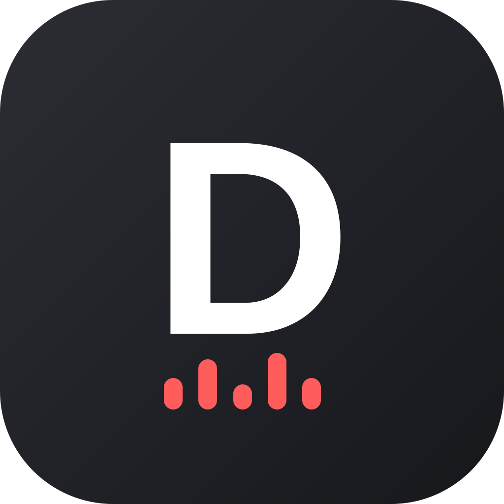

<p align="center">
  
</p>

<h1 align="center">Dictify</h1>

<p align="center">A macOS menu bar app for push-to-talk dictation in Turkish and English, fully on-device (Whisper for transcription, a local Ollama model for cleanup).</p>

## Quick Start

For a brand-new machine, in order:

1. **Clone this repo:**
   ```bash
   git clone https://github.com/alperengokbak/dictify.git
   cd dictify
   ```
2. **Install dependencies** — Homebrew packages, the Ollama cleanup model, the Whisper transcription model, and a Python virtualenv, all in one step:
   ```bash
   chmod +x install.sh
   ./install.sh
   ```
   Requires [Homebrew](https://brew.sh) already installed. Downloads a few hundred MB to ~1.5GB (mostly the Whisper model), so it can take a few minutes on a slow connection.
3. **Build and run the `.app` bundle** — this is the recommended way to run it, not just an alternative: macOS ties permission prompts (Microphone, Accessibility) to a real app identity, and a bare Python process can fail to trigger them correctly or show up as "python3.11" instead of "Dictify" in System Settings. See [Run](#run) below for the build command.
4. **Grant permissions** the first time macOS prompts you (Microphone, then Accessibility) — see [Required macOS permissions](#required-macos-permissions) if a prompt doesn't appear or paste doesn't work.
5. **Try it:** press `⌃⌥⌘D` (the default hotkey) to start recording, speak, press it again to stop — the cleaned-up transcript pastes into whatever's focused, and you'll hear a short "Tink"/"Pop" cue on start/stop.
6. *(Optional)* [Set it to launch automatically at login](#launch-at-login).

Everything below is reference detail for each of these steps.

## Install

```
./install.sh
```

This installs `whisper-cpp`, `ollama`, and `portaudio` via Homebrew, starts the Ollama service, pulls the `qwen2.5:3b` cleanup model, downloads the Whisper medium multilingual model, and sets up a Python virtualenv with the required packages.

## Run

**Recommended: build and run the real `.app` bundle.** macOS ties permission prompts and grants (Microphone, Accessibility) to an app's identity — a bare Python process either shows up as "python3.11" in System Settings instead of "Dictify", or can fail to trigger the permission prompt at all. Build it with:

```bash
.venv/bin/python -m pip install -r requirements.txt
.venv/bin/python setup.py py2app -A
cp -R dist/Dictify.app /Applications/Dictify.app
```

Then open `Dictify.app` from `/Applications` (findable via Spotlight/Launchpad like a normal app).

The `-A` (alias mode) flag is required — it produces a bundle that references this repo's live files and `.venv` by path instead of freezing a standalone copy, so editing `dictate.py` and restarting picks up changes with no rebuild step. That also means the bundle hardcodes absolute paths back to this repo and its `.venv` (visible in `Contents/Resources/__boot__.py` if you're curious) — moving either requires rebuilding. It stays a menu-bar-only app (`LSUIElement` in its `Info.plist`) — no Dock icon, no Cmd+Tab entry, opening it just puts the 🎙 in the menu bar. It also refuses to launch a second copy if one (e.g. the LaunchAgent's) is already running.

The app lives in the menu bar. Press the hotkey once to start recording, press it again to stop; the transcript is cleaned up and pasted into the frontmost app automatically. A small floating waveform indicator appears near the bottom of the screen while recording, showing your live voice level, and disappears the moment you stop — it doesn't steal keyboard focus from whatever you're dictating into.

**For development only:** `.venv/bin/python dictate.py` runs it directly without building anything, which is faster to iterate with but comes with the permission caveat above — expect to grant permissions to "python3.11" instead of "Dictify" if you run it this way, and possibly not be prompted at all on a fresh machine.

## Required macOS permissions

- **Microphone** — needed to record audio.
- **Accessibility** — needed for simulating the paste keystroke into the frontmost app. Without Accessibility access, the simulated paste silently does nothing even though recording, transcription, and cleanup all still succeed — you'll get a correct transcript on the clipboard with no visible error, so if pasting never happens, check this first. (The global hotkey itself is registered via macOS's native Carbon hotkey API and does not need Accessibility access.)

Grant both under System Settings > Privacy & Security. If you run Dictify via `Dictify.app` (directly or through the LaunchAgent), grant permission to "Dictify" itself — it's a real app bundle with its own identity, not a bare interpreter, so the permission entry is named "Dictify" rather than "python3.11".

## Launch at login

To have Dictify start automatically instead of running it by hand each time, install it as a per-user LaunchAgent:

```bash
cp local.dictify.plist ~/Library/LaunchAgents/
launchctl bootstrap gui/$(id -u) ~/Library/LaunchAgents/local.dictify.plist
```

(the plist's `ProgramArguments` paths need to match wherever you actually cloned this repo — edit it first if that differs from `/Users/alperengokbak/vsCode/general-question-for-claude/dictify`)

It restarts automatically if the app crashes (`KeepAlive` with `SuccessfulExit: false`), but not after you quit it deliberately via the menu bar's Quit item. Logs go to `~/Library/Logs/dictify.log` and `.err.log`.

Once loaded, it shows up in **System Settings → General → Login Items → Allow in the Background**, where you can toggle it on/off. That toggle is enable/disable only — to change what it actually runs, edit the plist and reload it:

```bash
launchctl bootout gui/$(id -u)/local.dictify
launchctl bootstrap gui/$(id -u) ~/Library/LaunchAgents/local.dictify.plist
```

To remove it entirely: `launchctl bootout gui/$(id -u)/local.dictify && rm ~/Library/LaunchAgents/local.dictify.plist`.

## Configuration

Settings live in `~/.config/dictify/config.json` and are created with defaults on first run. Most of them can be edited from the menu bar's **Preferences...** window (hotkey, Whisper model size, glossary, silence thresholds, history limit, cleanup/history toggles, sound toggle) instead of hand-editing the file.

### Hotkey

Default is Control+Option+Command+D (`<ctrl>+<alt>+<cmd>+<d>`) — three modifiers plus a key is deliberately unusual to minimize the chance of colliding with an existing app or system shortcut. The hotkey is registered with macOS's native Carbon hotkey API (`RegisterEventHotKey`), the same mechanism Spotlight and apps like Alfred and Rectangle use — it's consumed system-wide before it ever reaches the frontmost app, so unlike a plain key-event listener, nothing leaks into whatever you're typing into. That also means it needs a real, non-modifier key: exactly one of `<a>`–`<z>`, `<0>`–`<9>`, `<f1>`–`<f20>`, `<space>`, `<tab>`, `<return>`, `<escape>`, `<delete>`, or an arrow key (`<left>`/`<right>`/`<up>`/`<down>`), plus any combination of `<ctrl>`, `<alt>`, `<cmd>`, `<shift>` modifiers — modifier-only combos (e.g. just `<ctrl>+<alt>`) are no longer supported, since Carbon's hotkey manager has no way to represent them. Easiest way to set one is **Preferences... → Set Shortcut...**: hold your modifiers, press the key, done.

### Recording mode

Toggle (press to start, press again to stop) or push-to-talk (hold to record, release to stop) — switchable live from the menu bar's "Recording Mode" submenu.

### Sound feedback

Dictify plays a short system sound on every recording start ("Tink") and stop ("Pop"), so you can tell it's listening without looking at the menu bar icon. Controlled by the "Play sound on start/stop" checkbox in Preferences' **Feedback** section (config key `sound_feedback_enabled`, on by default).

### Language and style

Language can be forced to Turkish or English (instead of per-utterance auto-detect) from the "Language" submenu. Cleanup tone can be set to Default, Professional, or Casual from the "Style" submenu.

### Glossary

`"glossary"` is a list of proper nouns and jargon you say often (names, project/tool names, etc.) that speech-to-text tends to mangle:

```json
"glossary": ["Kubernetes", "PyQt", "Grafana"]
```

It's used two ways: as a hint to Whisper during transcription, and as a reference list the cleanup step uses to fix a misheard word back to the correct spelling — it won't rewrite words that are already correct or unrelated. Empty by default; edit it from **Preferences...** (one term per line) or directly in `config.json`.

### History

Every dictation's raw and cleaned text, with timestamp/language/style, is logged locally to `~/.config/dictify/history.jsonl` (on by default — `"history_enabled": false` in Preferences turns it off). "Show History" in the menu bar opens a readable, most-recent-first view; "Clear History" wipes it.

### Last transcript

The menu bar always shows a "Last: …" item with a truncated preview of your most recent dictation — this works even if `history_enabled` is turned off, since it's tracked independently of history logging. Click it to copy the full text to the clipboard. Before your first dictation it reads "Last: (none yet)" and is unclickable.

### Transcribe File...

Transcribes an existing audio or video file instead of live speech — pick one from the "Transcribe File..." menu item (anything ffmpeg can decode: mp3, mp4, m4a, mov, wav, etc.). Saves a `.txt` next to the input file and opens it, and logs it to History like a normal dictation.

## License

MIT — see [LICENSE](LICENSE).

Dictify depends on several external tools that are installed separately (via `install.sh`/Homebrew/pip) rather than bundled in this repo, each under its own license: [whisper.cpp](https://github.com/ggerganov/whisper.cpp) (MIT), [Ollama](https://github.com/ollama/ollama) (MIT), [ffmpeg](https://ffmpeg.org/legal.html) (LGPL/GPL depending on build), [rumps](https://github.com/jaredks/rumps) (BSD), [quickmachotkey](https://github.com/glyph/quickmachotkey) (MIT), [py2app](https://github.com/ronaldoussoren/py2app) (MIT), [sounddevice](https://github.com/spatialaudio/python-sounddevice) (MIT), and [numpy](https://numpy.org/) (BSD).
